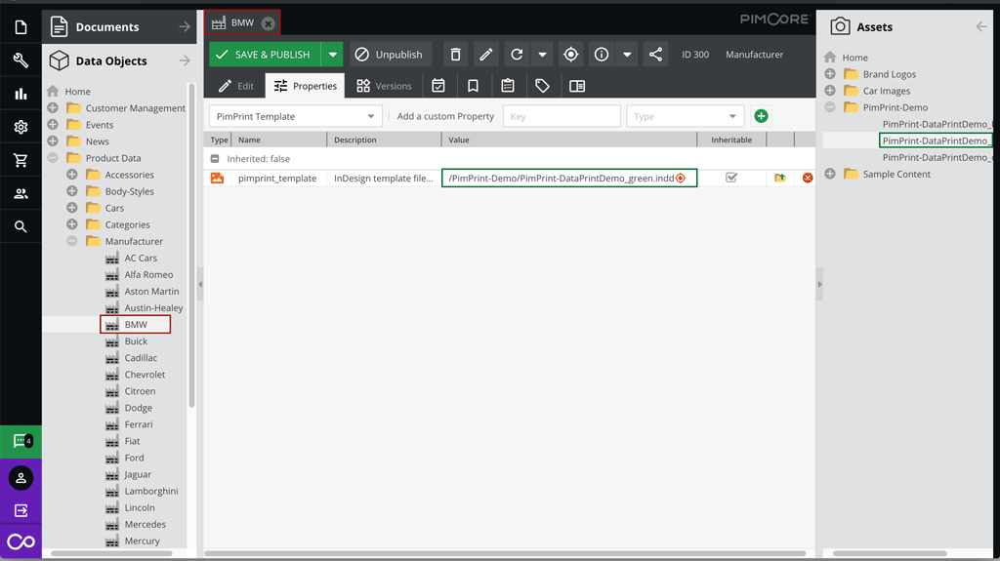

# DataPrint Demos
DataPrint demos are real world example print products generated with content from the Pimcore demo. They show the integration into Pimcore and usage of an arbitrary data model.

* [Project Content](#page_Project_Content)
* [PimPrint Features](#page_PimPrint_Features)

## Project Content
* [Car Brochure / Car List](#page_Car_Brochure_Car_List)
* [AccessoryPart List](#page_AccessoryPart_List)

### Car Brochure / Car List
Car centric print products can be generated for Categories `products/cars` or Manufacturers. The Pimcore DataObject structures are transformed to a publication tree.

### AccessoryPart List
AccessoryPart print products can be generated for Categories `products/spare parts` or Manufacturers. The Pimcore DataObject structures are transformed to a publication tree.

## PimPrint Features
* [Comprehensive Document update](#page_Comprehensive_Document_update)
* [Render Modes](#page_Render_Modes)
* [Changing the Template](#page_Changing_the_Template)

### Comprehensive Document update
After generation process PimPrint creates a textbox on first page outside page margins at top left position on a non printable layer called `PimPrint Update-Info`. This textbox contains information regarding the generated publication, language, generation timestamp, etc. 
 

PimPrint uses this textbox to identity the publication generated into the document. When a document with this textbox is opened, or [plugin is reloaded](./01_Overview.md#page_Reload_Plugin), the publication and language generated in the document is automatically preselected. This allows fast content update of a previously generated document.

Open your Pimcore Demo backend and edit some data rendered in your document:
- (Un)Publish some cars or car variants
- Edit descriptive texts
- etc.

Go back to InDesign click the _Start Generation_ button.   
This will start a content update of the previous generated document.

After generation is finished the content in the document will be upated with the current data in the Pimcore database. Changes elements where moved into different layers to give comprehensive feedback of the update generation process.

| Layer | Documentation |
| --- | --- |
| PimPrint-Deleted | Elements that has been removed in the update process. This layer is set to invisible automatically.| 
| PimPrint-Updated | Element content was updated. | 
| PimPrint-Created | New created elements. | 

### Render Modes
PimPrint offers different render modes.

| Mode | Documentation |
| --- | --- |
| All elements (position and content) | This is the main generation and rebuild mode. All elements are generated/updates with position and content. |
| All elements (content) | This mode is used, when manual layout adaptions where made in the document. All content of document is updated, leaving all manual positioning as it is currently in the document |
| Selected elements (content) | This mode is for partial content update of document. Only content of selected elements is updated.  |

### Changing the Template
The DataPrint demo projects have a custom example implementation for setting the used InDesign template when generating Category or Manufacturer by assigning a predefined property.

In this example the green demo template is assigned to the Manufacturer BMW. When documents for BMW are generated layout elements will be generated in green.  
As the project implementation with PimPrint is absolutely customizable data model fields or any other logic can be used to determine the used template file.    
