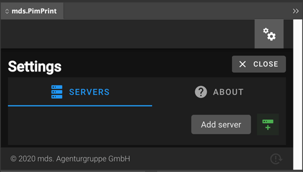
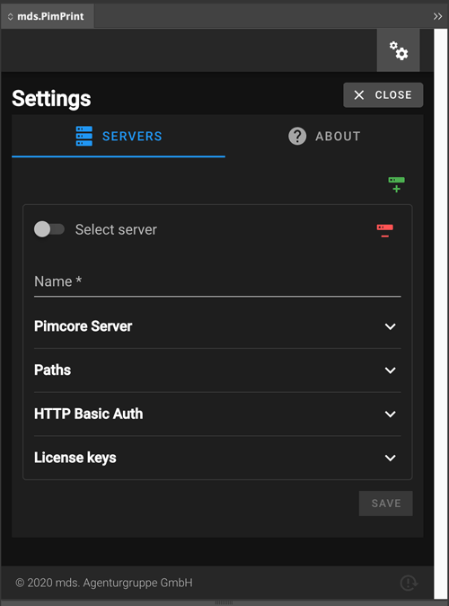
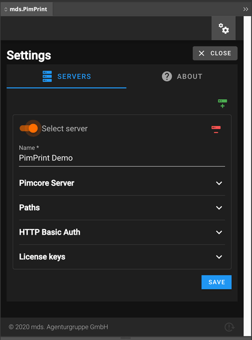

# Configuring server connections
The connection to the Pimcore server is configured in the plugin _Settings_ pane which opens up by clicking the gear wheel icon in the top right corner of the plugin window.

The management of server connections includes:
* [Adding a server](#page_Adding_a_server)
* [Configuring a server](#page_Configuring_a_server)
    * [Image and template paths](#page_Image_and_template_paths)
* [Activating a server](#page_Activating_a_server)

# Adding a server
Open the _Servers_ pane in settings and click the green _Add server_ button.

# Configuring a server

Each server connection is identified by a _Name_ and holds configuration for _Pimcore Server_, _Paths_, _HTTP Basic Auth_ and _License keys_.

 
The following table describes all configuration elements for server connections:

|Group|Field|Required|Description|
|---|---|---|---|
|Pimcore Server|Host/URL|Yes|URL to the Pimcore installation. URL used in Browser to access Pimcore Backend without tailing _/admin_.|
|Pimcore Server|Username|Yes|Pimcore Backend username|
|Pimcore Server|Password|Yes|Pimcore Backend password|
| | | | |
|Paths|Image Path|Yes|Absolute path on the local hard disk for saving downloaded image files. For detailed information please refer to the [Image and template paths](#page_Image_and_template_paths) chapter below.|
|Paths|Template Path|Yes|Absolute path on the local hard disk for saving downloaded InDesign template files. For detailed information please refer to the [Image and template paths](#page_Image_and_template_paths) chapter below.|
| | | | |
|HTTP Basic Auth|Username|No|Username if your Pimcore installation is Basic Auth protected.|
|HTTP Basic Auth|Password|No|Password if your Pimcore installation is Basic Auth protected.|
| | | | |
|License Keys|License Key|Yes|Your PimPrint License key|

After entering all required data the settings can be saved by clicking the blue save button.

## Image and template paths
By default, PimPrint plugin downloads InDesign template files and images directly from the Pimcore server. These files are stored on the local hard disk in the configured `Image Path` and `Template Path` directories.

PimPrint allows three possible scenarios of handling images and template files:

__1. Scenario: Individual files__   
In this __default scenario__ all files are downloaded from the Pimcore server and are stored on the local hard disk of the designer. Each designer downloads all files separately to the own hard disk. 

__2. Scenario: Shared files__  
A possible scenario is that `Image Path` and `Template Path` point to a fileserver in your company network. All designers have access to this fileserver and share the images and template files. Files are downloaded once from the Pimcore server and all designers uses the same files.

This scenario reduces the download traffic of your Pimcore server and saves local disk space, since all designers use the same image files located on the fileserver.

__3. Scenario: Direct server access__  
By deactivating the download of image files and/or template files PimPrint doesn't download any files from the Pimcore server. In this case some NFS access to the Pimcore asset directory `web/var/assets` must be configured. 

This scenario is for productions which uses very large image files, where download of many GBs of data would slow production down.

> Note for developers:  
> Please refer to [Project Configuration Reference](../10_Rendering_Projects/00_Configuration_Reference.md) for the configuration of assets and template download.

# Activating a server
Multiple server connections can be configured as described in the chapter above. The current active server used for generating documents can be activated in the connection settings with whe toggle element _Select server_.
  
At the moment a server is selected the Plugin checks the Pimcore server URL and login credentials for validity. If connection fails a popup window appears. If connection is successful the server will be selected as shown in the following screenshot. 

After activating the desired server connection click the _Close_ button in the upper right corner to get back to the Plugin main window.
